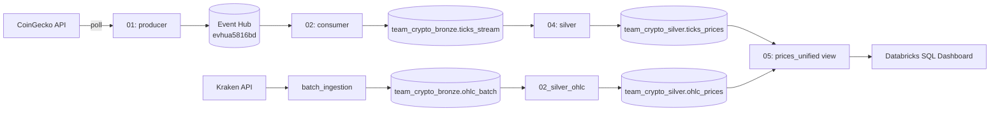

# crypto-demo

End-to-end batch + streaming ingestion into a governed Unity Catalog bronze/silver layer, with a live schema-evolution demo. Built for the Labs 1-3 team checkpoint.

## Architecture

Catalog: `dbr_dev_ua5816bd`. Schemas: `team_crypto_bronze`, `team_crypto_silver`.

## Repo structure

| File | Owner | Purpose |
|---|---|---|
| `infra_setup.ipynb` | Infra | Catalog/schema/volume, external location, secret scope |
| `batch_pipeline/01_batch_ohlc_ingestion.ipynb` | Batch | Historical OHLC (Kraken) → `team_crypto_bronze.ohlc_batch`, idempotent merge |
| `batch_pipeline/02_silver_ohlc.ipynb` | Batch | Cleans/dedupes OHLC → `team_crypto_silver.ohlc_prices` |
| `streaming_pipeline/01_producer_price_ticks.ipynb` | Streaming | Polls CoinGecko, sends events to Event Hub |
| `streaming_pipeline/02_consumer_bronze_ticks.ipynb` | Streaming | Kafka-protocol consumer → `team_crypto_bronze.ticks_stream` |
| `streaming_pipeline/03_schema_evolution_twist.ipynb` | Streaming | Demo: new field added mid-stream, no restart |
| `streaming_pipeline/04_silver_prices.ipynb` | Streaming | Schema-inferred parse + normalize symbols → `team_crypto_silver.ticks_prices` |
| `streaming_pipeline/05_unified_prices_view.ipynb` | Streaming | `prices_unified` view combining batch + streaming for the dashboard |
| `dashboard/` | Analytics | Databricks SQL dashboard definition/notes |

## One-time setup (Databricks)

1. Connect this repo as a Git folder in the shared workspace.
2. Cluster: shared all-purpose cluster. Install library via **PyPI**: `kafka-python` (no Maven/allowlist needed — Event Hub is accessed over its Kafka-compatible endpoint).
3. Secret scope `team-crypto-scope` (backed by the shared Key Vault) must contain:
   - `eventhub-connection-string`
   - `eventhub-name`
   - `eventhub-namespace`

No catalog, schema, or Event Hub name is hardcoded in any notebook — every notebook exposes them as **job/task parameters** (`dbutils.widgets`) with sensible defaults, so the same code runs unchanged across environments.

## Running order

| Step | Notebook | Key parameters |
|---|---|---|
| 1 | `infra_setup.ipynb` | — |
| 2 | `batch_pipeline/01_batch_ohlc_ingestion.ipynb` | `catalog`, `bronze_schema` |
| 3 | `streaming_pipeline/02_consumer_bronze_ticks.ipynb` | `catalog`, `bronze_schema`, `eventhub_namespace`, `eventhub_name`, `secret_scope`, `checkpoint_base` |
| 4 | `streaming_pipeline/01_producer_price_ticks.ipynb` | `eventhub_namespace`, `eventhub_name`, `secret_scope`, `symbols`, `poll_seconds`, `iterations` |
| 5 | `streaming_pipeline/04_silver_prices.ipynb` | `catalog`, `bronze_schema`, `silver_schema` |
| 6 | `batch_pipeline/02_silver_ohlc.ipynb` | `catalog`, `bronze_schema`, `silver_schema` |
| 7 | `streaming_pipeline/05_unified_prices_view.ipynb` | `catalog`, `silver_schema` |
| 8 | Dashboard over `team_crypto_silver.prices_unified` | — |

Start the consumer (step 3) before the producer (step 4) so no early events are missed.

## Schema evolution demo (live)

1. Consumer stream (02) running for a few minutes.
2. Edit the producer's event payload to add `volume_24h`, rerun once.
3. Run `streaming_pipeline/04_silver_prices.ipynb` again — schema inference (from the newest row) picks up the new field automatically, no restart, no code change.

## Idempotency

- Batch: `MERGE` on `(symbol, timestamp)` — rerunning `batch_pipeline/01_batch_ohlc_ingestion.ipynb` never duplicates rows.
- Streaming: checkpoint-based, exactly-once per checkpoint — rerunning the consumer after a restart resumes from the last committed offset.

## Git workflow

Branch per role: `feature/infra-setup`, `feature/batch-ingestion`, `feature/streaming-ingestion`. One PR per branch, at least one review from a teammate before merge into `main`.