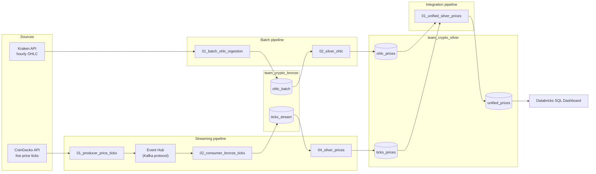

# crypto-demo

Team project for the Databricks/Azure Data Engineering course: a batch + streaming pipeline for crypto prices (BTC, ETH, SOL), merged into one silver table and shown on a dashboard.

## Architecture

Batch and streaming run independently and each writes its own silver table (`ohlc_prices`, `ticks_prices`). The `integration_pipeline` combines both into one table, `unified_prices`, which feeds the dashboard.

## Repo structure

| Folder / file | What it does |
|---|---|
| `batch_pipeline/01_batch_ohlc_ingestion.ipynb` | Loads hourly OHLC data from Kraken API (BTC, ETH, SOL) into `team_crypto_bronze.ohlc_batch`, idempotent MERGE on `symbol, timestamp_unix` |
| `batch_pipeline/02_silver_ohlc.ipynb` | Casts types, normalizes symbol, dedups, MERGE into `team_crypto_silver.ohlc_prices` |
| `streaming_pipeline/01_producer_price_ticks.ipynb` | Polls CoinGecko `simple/price` every N seconds, sends JSON to Event Hub over the Kafka protocol |
| `streaming_pipeline/02_consumer_bronze_ticks.ipynb` | Structured Streaming from Event Hub (Kafka format) into `team_crypto_bronze.ticks_stream`, stored as raw JSON (no fixed schema — needed for the schema evolution demo) |
| `streaming_pipeline/03_schema_evolution_twist.ipynb` | Demo helper: checks that a new field reaches silver without restarting the stream |
| `streaming_pipeline/04_silver_prices.ipynb` | Infers schema from the newest bronze row (`F.schema_of_json`), normalizes symbol (bitcoin → BTC etc.), MERGE into `team_crypto_silver.ticks_prices` |
| `integration_pipeline/01_unified_silver_prices.ipynb` | Combines `ohlc_prices` + `ticks_prices` into one table with a `record_type` column (`ohlc_batch` / `streaming_tick`), MERGE into `team_crypto_silver.unified_prices` |
| `infra_setup.ipynb` | Schemas, volume, secret scope (Unity Catalog setup) |
| `README.md` | This file |

## Run order

1. `infra_setup.ipynb` — once, by whoever owns infra
2. `batch_pipeline/01_batch_ohlc_ingestion.ipynb` → `batch_pipeline/02_silver_ohlc.ipynb`
3. `streaming_pipeline/01_producer_price_ticks.ipynb` (runs in the background) → `streaming_pipeline/02_consumer_bronze_ticks.ipynb` (streaming job) → `streaming_pipeline/04_silver_prices.ipynb` (batch run on top of the stream)
4. `integration_pipeline/01_unified_silver_prices.ipynb` — last step, once both silver tables have data
5. Databricks SQL dashboard on top of `team_crypto_silver.unified_prices`

## Schema evolution demo

1. Start the producer and consumer, let them run for a few minutes
2. In `01_producer_price_ticks.ipynb`, uncomment the line that adds a new field, `volume_24h`
3. Restart only the producer — the consumer (`02_consumer_bronze_ticks`) doesn't need touching, since it just stores raw JSON
4. Rerun `04_silver_prices.ipynb` — the new field shows up automatically via `F.schema_of_json()` on the latest row, no code change and no stream restart needed

## Idempotency

Every write to bronze and silver goes through `MERGE`, keyed on:
- `ohlc_batch` / `ohlc_prices`: `symbol, timestamp_unix` / `symbol, event_time`
- `ticks_stream` / `ticks_prices`: `symbol, event_time`
- `unified_prices`: `symbol, event_time, record_type`

Rerunning any notebook without new data doesn't change row counts in the target table.